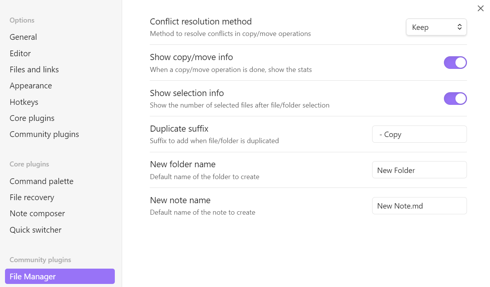

# File Manager Plugin for Obsidian

This plugin enhances the Obsidian File Explorer by adding essential file management features. It introduces several new commands when the `File Explorer` panel is focused, allowing users to bind hotkeys to these operations. The goal is to enable complete file management within Obsidian using only the keyboard.

## Features

-   **Create subfolder**: Create a subfolder of current folder.
-   **Create folder**: Create sibling folder.
-   **Create note**: Create note in current folder.
-   **Duplicate**: Duplicate file/folder.
-   **Move**: Move selected files/folders to existing location.
-   **Copy**: Copy selected files/folders to existing location.
-   **Copy, Cut and Paste**: Copy or cut selected files/folders to clipboard and paste from it.
-   **Toggle Selection**: Toggle selection of file/folder.
-   **Select All**: Select all files/folders.
-   **Deselect All**: Clear selection
-   **Invert Selection**: Invert the current selection.
-   **Rename**: Rename file/folder.

### Conflict Resolution

When a file conflict arises, you can either be prompted to choose a resolution or apply a predefined method:

-   **Overwrite**: Replace the existing file/folder.
-   **Skip**: Ignore the conflicting file/folder.
-   **Keep**: Retain both files by renaming the new one.

## Usage

> **IMPORTANT**: Only when you have the focus in the `File Explorer` panel, the following commands will be available.

### Commands

-   `Create a subfolder within the focused or active file/folder`.
-   `Create a folder as sibling of the focused or active file/folder`.
-   `Create a note within the focused or active folder`.
-   `Duplicate focused or active file/folder`,
-   `Copy selected files/folders to clipboard`,
-   `Paste files/folders from clipboard to selected folder`,
-   `Cut selected files/folders to clipboard`,
-   `Move selected files/folders to a new folder`.
-   `Copy selected files/folders to a new folder`.
-   `Select all siblings and children of the focused or active file/folder`.
-   `Toggle selection of the focused or active file/folder`.
-   `Clear selection`.
-   `Invert selection`.
-   `Rename focused or active file/folder`.

## Installation

Select `File Manager` from the community available plugins.

## Configuration

There's a settings tab for the plugin to customize behaviour.

## Development

1. Clone this repository into the `.obsidian/plugins` folder of an obsidian Vault.
2. Ensure your NodeJS version is at least v16 (`node --version`).
3. Run `npm install` to install dependencies.
4. Run `npm run dev` to start compilation in watch mode.
5. In obsidian settings turn on `File Manager` plugin.

## Support

For any issues or feature requests, please open an issue on the GitHub repository.

## License

This plugin is licensed under the MIT License.

## Roadmap

-   Implement **merge** for folders copy/move.
-   After copying/moving files, autoselect files on destination.
-   Better UI feedback when copying or cutting files to clipboard.
-   Better information for files copied/moved.
