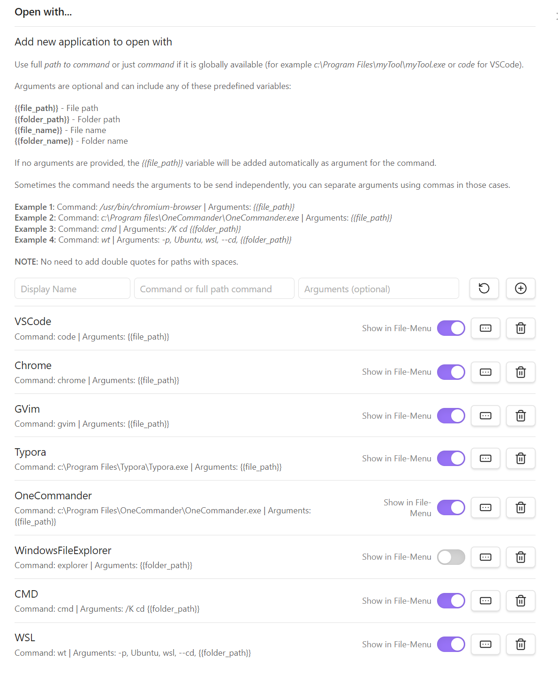
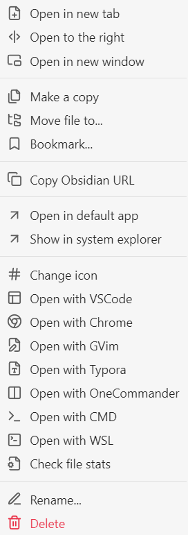
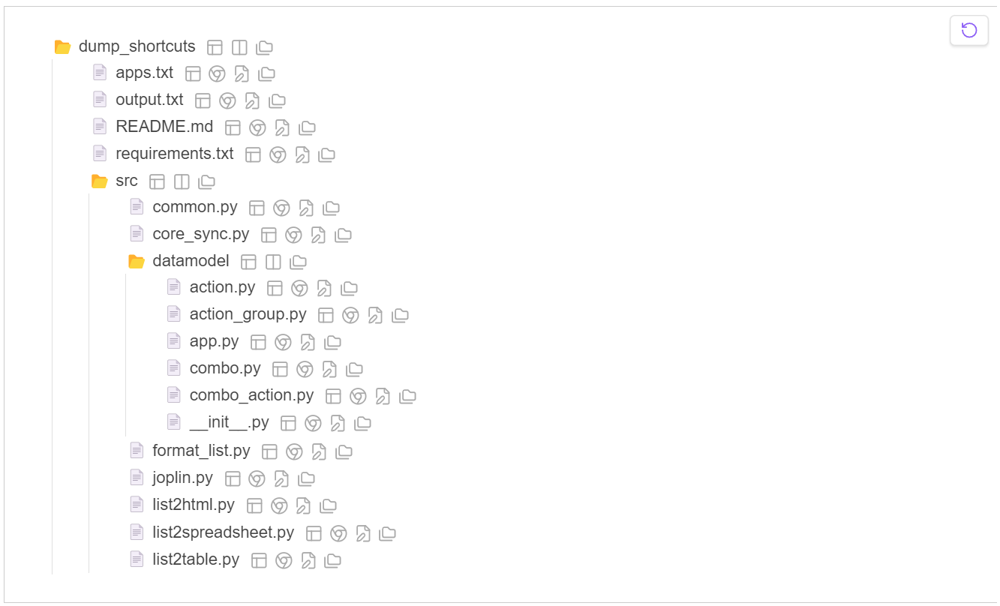
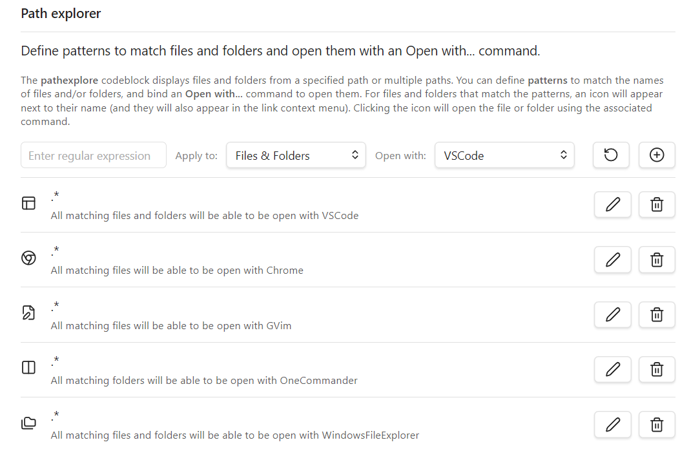

# File Manager Plugin for Obsidian

This plugin enhances the Obsidian File Explorer by adding essential file management features. It introduces several new commands to interact with the `File Explorer`, allowing users to bind hotkeys to these operations. The goal is to enable complete file management within Obsidian using only the keyboard.

**NOTE**: Added to 1.2 version new `pathexplorer` codeblock. See details below.

## Features

-   **Open with**: Open file/folders with custom commands.
-   **Go to file/folder**: Find and focus on a file/folder in the file explorer.
-   **Create subfolder**: Create a subfolder of current folder.
-   **Create folder**: Create sibling folder.
-   **Create note**: Create empty note in current folder.
-   **Duplicate**: Duplicate file/folder.
-   **Move**: Move selected files/folders to existing location.
-   **Copy**: Copy selected files/folders to existing location.
-   **Copy, Cut and Paste**: Copy or cut selected files/folders to clipboard and paste from it.
-   **Clear Clipboard**: Clear clipboard.
-   **Toggle Selection**: Toggle selection of file/folder.
-   **Select All**: Select all files/folders.
-   **Invert Selection**: Invert the current selection.
-   **Deselect All**: Clear selection.
-   **Rename**: Rename file/folder.
-   **pathexplorer codeblock**: Show files and folders of provided path/s and open them with custom commands.

### Copy/Move Conflict Resolution

When a file conflict arises, you can either be prompted to choose a resolution or apply a predefined method:

-   **Overwrite**: Replace the existing file/folder.
-   **Skip**: Ignore the conflicting file/folder.
-   **Keep**: Retain both files by renaming the new one.

## Usage

### File Explorer Commands

> **NOTE**: Only when you have the focus in the `File Explorer` panel, the following commands will be available.

-   `File Manager: Create a subfolder within the focused or active file/folder`.
-   `File Manager: Create a folder as sibling of the focused or active file/folder`.
-   `File Manager: Create a note within the focused or active folder`.
-   `File Manager: Duplicate focused or active file/folder`,
-   `File Manager: Copy selected files/folders to clipboard`,
-   `File Manager: Cut selected files/folders to clipboard`,
-   `File Manager: Paste files/folders from clipboard to selected folder`,
-   `File Manager: Clear clipboard`,
-   `File Manager: Move selected files/folders to a new folder`.
-   `File Manager: Copy selected files/folders to a new folder`.
-   `File Manager: Select all siblings and children of the focused or active file/folder`.
-   `File Manager: Toggle selection of the focused or active file/folder`.
-   `File Manager: Clear selection`.
-   `File Manager: Invert selection`.
-   `File Manager: Rename focused or active file/folder`.

### Global Commands

> **NOTE**: The following command is available if there is a file explorer in Obsidian.

-   `File Manager: Go to file or folder in file explorer`.

> **NOTE**: The following command is globally available. If the file explorer is active,
> the focused or selected file/folder will be used to Open With. If not, the
> current active document in Obsidian, will be used to Open With.

-   `File Manager: Open with ...`

Using the settings tab, new custom _open with_ commands can be created.



The _open with_ commands are also available in the _File Context Menu_ if option is selected in the settings.



### pathexplorer codeblock

Added in version 1.2 a new `pathexplorer` codeblock it's available. For example
if you write this codeblock in a note:

````
```pathexplorer
# Path or paths to explore.
path C:\projects\dev\dump_shortcuts

# If present include dump_shortcuts as root of files and folders. 
include-root

# Use .gitignore syntax to ignore files/folders.
ignore .git/
ignore .venv/
ignore old/
ignore build/
ignore dist/
ignore test*/
ignore __pycache__/
ignore .*
ignore *.bat
ignore *.spec

# Define max-depth (default 1)
max-depth 3

# Define max-files (default 100)
max-files 20 
```
````

You will see something like this in the reader mode.



#### `pathexplorer` codeblock syntax.

> **#** 
> 
> For line comments
> 
> **path \<relative or absolute path\>**
> 
> Path to explore (Win/Mac/Linux format supported). Multiple paths
> can be defined, one per line. Paths will be shown one after another.
> 
> **include-root**
>
> If path is a folder, show folder as parent of dangling children.
>
> **max-depth**
>
> Max depth level to explore in the tree.
>
> **max-files**
>
> Max number of files/folders to show.
>
> **ignore**
>
> Use `.gitignore` patterns to ignore files and folders. Inverted
> patterns are also supported (`!<pattern>`). Multiple ignore patterns
> can be defined, one per line.
>
> **flat [\<none\> | hide-files | hide-folders]**
>
> Omit tree hierachy, files and folders will be shown as a list.
> Optional hide-files and hide-folders can be used in combination with
> flat.
>
> **hide-icons**
>
> If matching patterns have been defined in settings, after a 
> file/folder a command icon wil be shown (if pattern matches)
> allowing the user to click and execute the command. Commands
> are also added to the file/folder context menu.

Using the settings tab, new custom _patterns_ can be created.



## Installation

Select `File Manager` from the community available plugins.

## Configuration

There's a general settings tab for the plugin to customize behaviour.

**NOTE**: See `Open With...` and `pathexplorer` sections for more settings.


## Development

1. Clone this repository into the `.obsidian/plugins` folder of an obsidian Vault.
2. Ensure your NodeJS version is at least v16 (`node --version`).
3. Run `npm install` to install dependencies.
4. Run `npm run dev` to start compilation in watch mode.
5. In obsidian settings turn on `File Manager` plugin.

## Support

For any issues or feature requests, please open an issue on the GitHub repository.

## License

This plugin is licensed under the MIT License.

## Roadmap

-   Implement **merge** for folders copy/move.
-   After copying/moving files, autoselect files on destination.

## Acknowledgments

This plugin has been inspired by the following plugins. Thanks in advance to all the developers.

-   [Obsidian Open With](https://github.com/phibr0/obsidian-open-with)
-   [Obsidian File Explorer Count](https://github.com/ozntel/file-explorer-note-count)
